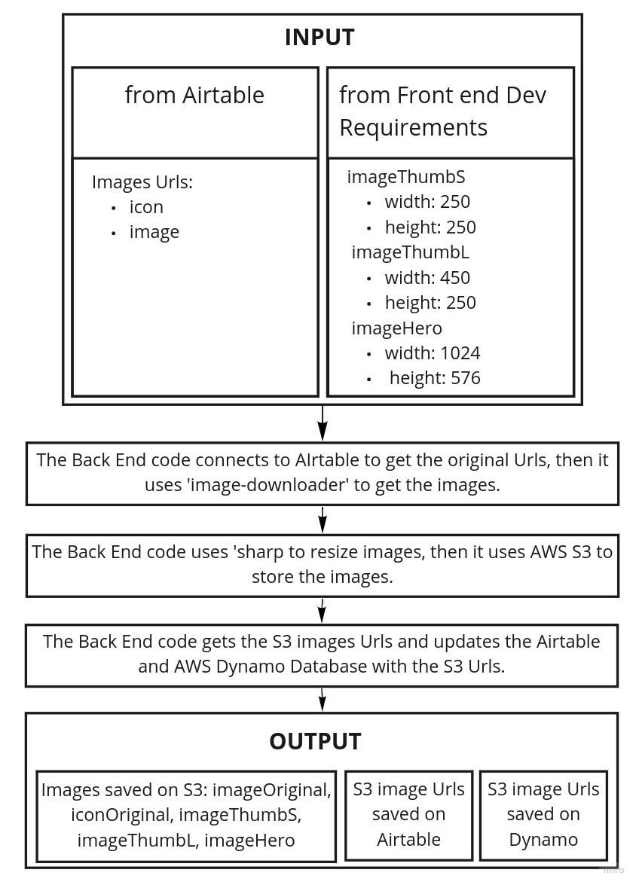

# ResizeImages

This is a piece of code I created for the purpose of resizing and saving images to AWS S3 from images Urls.

## The problem

The company needs to provide quality picture for every resource they present to the end user. For example, for the resource 'yoga class' there will be:

- one small picture for the web version card when it is among a table of other cards
- one big picture for the web version when the card is selected and displayed on the whole screen

There were a few problems:

- when we pick pictures from Urls on the internet, it could be deleted or modified
- the format could vary and damage the end user experience
- we needed a thrird format for the mobile version of BetterSpace

## The stakeholders

The Head of Directories, the Front end and the the Back end Developer were involved in the process.

## The requirements - User stories

As a Head of Directories:

- So I can easily pick pictures from the internet and add them to resources, I need to:

  - Be sure that the picture I upload can not be deleted by a third party and matches the required format for the best end user experience

As a Front end Developer:

- So I can optimize the loading time of the website and the app, I need to:

  - Use pictures with the right balance between light weight and good quality

## Diagrams

Here is a big picture diagram of the tool.

